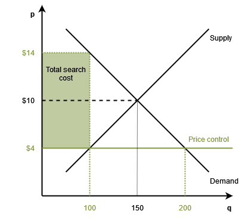

## The inflation rate

Inflation in the US has become a hot topic. The [Personal Consumption Price Index Excluding Food and Energy (PCPI)](https://www.bea.gov/data/personal-consumption-expenditures-price-index-excluding-food-and-energy) (the Fed's preferred measure of inflation), has spiked from a low of 0.9% yearly inflation rate in May to high of 4.7% in November. Starting in March, PCPI inflation has been above the Fed's 2% target. The November figure is the highest one since February 1989. 

The Fed has an [average inflation target (AIT) of 2-percent](https://fredblog.stlouisfed.org/2020/11/from-inflation-targeting-to-average-inflation-targeting/). It doesn’t matter how monetary authorities calculate that target; recent numbers show that the inflation rate is above the Fed’s limit.

<iframe src="https://fred.stlouisfed.org/graph/graph-landing.php?g=KrXf&width=670&height=475" scrolling="no" frameborder="0" style="overflow:hidden;" allowTransparency="true" loading="lazy"></iframe>

## Price controls: Breaking the thermometer

To fight inflation, [Isabella Weber calls for the use of price controls](https://www.theguardian.com/business/commentisfree/2021/dec/29/inflation-price-controls-time-we-use-it?utm_term=Autofeed&CMP=twt_gu&utm_medium&utm_source=Twitter#Echobox=1640776964), a tool she describes as a "powerful weapon."

Because the inflation rate is the percent change of a price index, calling for price controls is like cheating. If prices are not allowed to change by law, then, of course, the price level will not rise. Calling this a victory against inflation is like claiming a fever is gone by breaking the thermometer. That price controls don't work is no news; we have [4000 years](https://t.co/8EPHATrUwU) of failed price control experiments.

Any introductory textbook covers the consequences of price controls to economics. Yet, there is one issue usually overlooked by advocates of price controls. The cost of acquiring a good with a regulated price is **higher** than acquiring said good with an unregulated price. The reason is that the price control creates a shortage. This shortage means that consumers must incur search costs to acquire the goods (such as waiting in long lines). The regulated price plus the search cost is higher than the free market price.

Consider the following example. At the free market (equilibrium) price of 10 dollars, consumers buy 150 units. Look first at the horizontal axis. A price ceiling of 4 dollars produces a reduction in quantity supplied to 100 units and an increase of quantity demanded of 50 units. There is a shortage of 100 units. Units traded fall from 150 to 100 units. Even if demand goes up, a price ceiling produces a fall in output and, therefore, a fall in wellbeing. Look now at the vertical axis. The price is 4 dollars, but consumers' willingness to pay has increased to 14 dollars. Consumers are willing to pay 10 dollars equivalent of search costs on top of the regulated price of 4 dollars. With unregulated prices, consumers buy 150 units at 10 dollars each. With a price control, consumers acquire 100 units at a total cost of 14 dollars each.

It seems that price controls are worse than breaking a thermometer. Price controls do not just conceal the symptoms of the disease; it makes the problem even worse.

