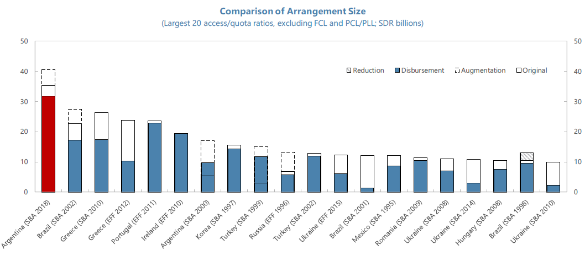
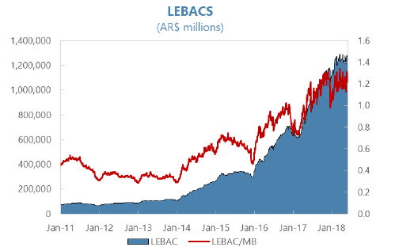

***

{}

---

The IMF published its ex-post [evaluation](https://www.imf.org/en/Publications/CR/Issues/2021/12/22/Argentina-Ex-Post-Evaluation-of-Exceptional-Access-Under-the-2018-Stand-By-Arrangement-511289) of the 2018 stand-by agreement (SBA) with Argentina last December. This document is particularly interesting because the agreement failed shortly after its implementation and represents the largest SBA in IMF’s history. The program was supposed to go through twelve revisions ending in 2021 but only made it through four revisions.

The outcome of this latest agreement with Argentina should provide important lessons. Even though it is unlikely to expect the IMF to criticize itself strongly, the document suggests that old lessons were never learned

## A confession of ingenuity

Probably unintended, despite being its largest SBA, the document reads as a confession of ingenuity on the part of the IMF when dealing with Argentina. On more than one occasion (for instance, on page 66), the IMF admits that relying on unreal or unlikely assumptions was an error. This confession is particularly curious given that the IMF was dealing with a poor track record as Argentina. I say that the document reads a confession of ingenuity because one would expect that by now, the importance of working with realistic and likely assumptions would be a lesson already learned.

Maybe another act of ingenuity was to rely on the economic forecasts provided by the Argentine government. The document admits that all predictions represented overestimations of what later happened with the variables of the Argentine economy.

## Stand-by agreement?

IMF’s SBA is preventive. The IMF explains that the agreement intended to trigger access to liquidity in the financial markets. The liquidity that Argentina faced would disappear upon signing the SBA, and therefore there would be no need to use the IMF’s funds. The SBA was supposed to work as a facilitator of **other** sources of liquidity; the IMF did not intend to become itself a source of liquidity.

However, it didn’t take long for the SBA to become a source of liquidity (rather than being used only in emergency cases). It is possible that the difference between the nature and the use made of the SBA did not help in building the confidence looked for by the IMF.

El Salvador offers an interesting contrast. In 2008, El Salvador got a SBA with the IMF for 800 million dollars for 15 months. Despite being a dollarized economy and the magnitude of the international financial crisis at the time, El Salvador did not need to use the stand-by funds.

## Stand-by agreement versus structural reforms

The main objective of the SBA was to facilitate access to credit markets by building confidence in Argentina. The diagnosis was that Argentina was facing a transitory illiquidity problem. Therefore, stand-by access to IMF's liquidity should be enough to eliminate the credit market's fears regarding Argentina's liquidity.

The lesson (a repeated one, not a new one) is that access to liquidity is no substitute for policy and structural reforms. The bad luck of external shocks (i.e., the Turkey crisis) was not the only reason Argentina faced an illiquidity problem. The source of Argentina's illiquidity is primarily of its design (unsustainable fiscal deficits, inconsistent economic policy, lack of protection to property rights, limited access to international trade, out-of-control inflation, and the list of self-inflicted problems goes on). Limited access to liquidity under these conditions is a symptom; it is not the problem. The fact that the IMF cannot (or does not want to) comment on Argentine politics does not mean the illiquidity problem was not, to a large part, self-inflicted. In other words, external shocks and sudden stops can have domestic causes.

## LEBACs, LEBACs, LEBACs,,,

An important fragility of Argentina’s economic policy was the sizable carry-trade operations fostered by the LEBAC policy. The LEBACs (Letras del Banco Central) were short-term bills issued by the Argentine central bank (BCRA). Both residents and non-residents were allowed to hold LEBACs. The BCRA issued its bonds because the Treasury bonds it has are non-negotiable and cannot use them to carry open market operations. The IMF document gives a special place to the vulnerability produced by the issuance of the LEBACs (Box 3, p. 36). The discussion concludes the following way (p. 36):

> The recurrent monthly rollover of LEBACS therefore created the potential for significant volatility. The instability of the interest rates, in turn, threatened the ability of the BCRA to set interest rates in a predictable way consistent with its inflation objectives. Given the inherent vulnerability of capital flows, LEBACs therefore became a potential trigger for sudden stops.

The LEBAC issue is hardly new. In the [press release of the request for a SBA](https://www.imf.org/en/Publications/CR/Issues/2018/07/13/Argentina-Request-for-Stand-By-Arrangement-Press-Release-and-Staff-Report-46078), Dujonve (Minister of Economics) and Sturzenegger (President of the BCRA) state that the "BCRA is committed to reducing the **vulnerability** attached to an **excessively large stock of LEBAC securities**" (p. 76, emphasis added). The LEBAC issue predates the request of the SBA agreement. The BCRA was aware of domestic critics and concerns regarding the use of the LEBACs. On some occasions, the BCRA would reply to these critics with an unnecessary derogatory tone.

To illustrate his point, the IMF shows the same [plot](https://www.elhubeconomico.com/graficos/02_agregados_monetarios/#gr%C3%A1fico-6-pasivos-del-bcra) that I used to update and share through Twitter regularly. The plot shows the evolution of the nominal amount of LEBACs outstanding and the LEBAC/monetary base ratio.

## Premature inflation targeting?

Another issue of Argentina’s economic policy was its application of an inflation-targeting regime. As the IMF mentions (p. 23), inflation targeting is typically applied **after** inflation is either low or in a clear downward trend. Central banks usually use inflation targeting to secure low inflation rates. However, Argentina seems to have intended to use an inflation targeting regime to make inflation rates go down. Maybe the BCRA was inspired by some particular case that used inflation targeting to decrease inflation rates. If that was the case, the BCRA based its policy on an outlier and non-representative case.

## Communication problems

The IMS points to two communication problems. The first one relates to infrequent (and probably confusing) communication from the Argentine government to the public about the details and objectives of the SBA. A poor communication on part of the government does not contribute to create the confidence the agreement was looking for. For instance, that President Macri publicly announced an agreement with backfired when it became public that said agreement was not yet being discussed with the IMF.

The second communication issue was between the Argentina government and the IMF. After a decade of no relations, the IMF says, the Argentine government had no proper knowledge of the IMF's procedures and internal regulations. This lack of knowledge ultimately produced a waste of precious time in a moment of financial distress.

## Argentina's history with the IMF: Which political movement signed the most agreements with the IMF?

The IMF points to two communication problems. The first one relates to infrequent (and probably confusing) communication strategy from the Argentine government to the public about the details and objectives of the SBA. Poor communication on the part of the government does not contribute to creating the confidence intended by the SBA. For instance, President Macri's public announcement of a deal with the IMF backfired when it became public that said agreement was not yet under discussion.

The second communication issue was between the Argentine government and the IMF. After a decade of no relations, the IMF says, the Argentine government had no proper knowledge of the IMF's procedures and internal regulations. This lack of knowledge ultimately produced waste of precious time in a moment of financial distress.

| Political party | Amount (millions of SDRs) | Number of agreements |
| --- | ---: | ---: |
| UCR | 7,931 | 3 |
| PJ | 17,989 | 7 |
| Cambiemos | 35,379 | 1 |

***

{}