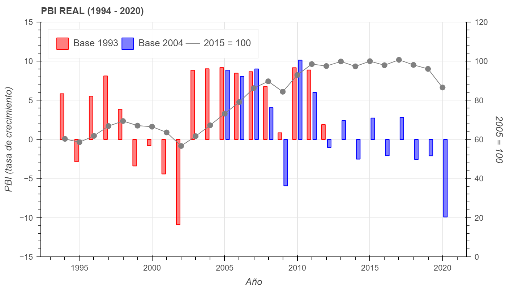

[Joseph E. Stiglitz](https://www.project-syndicate.org/commentary/argentina-covid-economic-miracle-by-joseph-e-stiglitz-2022-01) offers a surprising statement about Argentina when he says that "thanks to the current government's policies to strengthen the real economy, [Argentina] has been enjoying a remarkable recovery". For everyone familiar with the Argentine econoimc situation, Stigtliz's words are surprising. It takes special skills to see an economic miracle in a country on the brink of a major economic crisis.

## A fake miracle

Stiglitz bases his argument on Argentina’s real GDP growth of 11.9% in Q3 of 2021. What goes unmentioned in his article is a 10.2% fall of Argentina's GDP in the Q3 of 2020. This is important because is natural for a large growth rate to follow a large fall. The miracle looks even less impressive if we compare real GDP in Q3 of 2021 with that of 2019. What we find is GDP in Q3 of 2021 mere 0.5% higher than GDP in Q3 2019. More than a miracle, Argentina offers a textbook definition of **recovery**. Economic **growth** is an increase in output **capacity** and not a just a closing of the output *gap**. If you did not know, Argentina stagnated in 2011 (notice the graph below taken from [El Hub Económico](https://www.elhubeconomico.com/)).

  
Stiglitz’s miracle further vanishes if we compare Argentina's performance with the U.S. For instance, Q3 2021, the U.S. real GDP grew 4.9%, after falling 2.9% in 2020. This number is deceiving, since the U.S. real GDP fell 9% in Q2 2020 while Argentina's fell an incredible 19.7% in the same period. The bottom line is that the Argentine economy is a mere 0.5% above its value two years ago, while the U.S. real GDP is 5% higher. The graph below plots both GDPs indexed to 100 in Q3 2019. 

<iframe src="https://fred.stlouisfed.org/graph/graph-landing.php?g=KM7z&width=670&height=475" scrolling="no" frameborder="0" style="overflow:hidden;" allowTransparency="true" loading="lazy"></iframe>

## Short memory

Stiglitz thinks most of Alberto Fernández’s economic problems come from Macri's presidency. He forgets Macri himself received a very delicate scenario himself. Thus is far from clear Macri passed over a worse economy than the one he received. Therefore, the economy Fernández receive from Macri is an **indirect** gift from the previous Kirchner administration.

The IMF granted Macri's its [largest stand-by agreement](https://economic-order.netlify.app/post/2022-01-10/) in the institution's history. But, Macri issued this debt not only because of his economic policy, but also to face the debt issued by the Kirchner administration. Official debt numbers before Macri’s administration understate the outstanding debt because the Kirchner administration ignored the 2001 default holdouts.[^1] As Stiglitz is well aware, Argentina lost a trial against the holdouts in the New Your circuit. Argentina appealed all the way to the U.S. Supreme Court, who refused to hear the case, leaving Griesa’s fault standing. The debt owed to the holdouts was very real, as Judge Griesa's ruling stated. In 2014, Stiglitz and Martín Guzmán co-authored critical a [piece](https://www.project-syndicate.org/commentary/joseph-e--stiglitz-and-martin-guzman-argue-that-the-country-s-default-will-ultimately-harm-america#:~:text=Argentina%E2%80%99s%20Griesafault%20Aug%207%2C%202014%20Joseph%20E.%20Stiglitz%2C,full%20the%207%25%20who%20refused%20a%20restructuring%20deal.) on Griesa's ruling.[^2] Martín Guzmán is the current Minister of Economics of Argentina, but in 2014 he was a post-doctoral student under Stigtliz's supervision at Columbia University.[^3]
[^1]: I’m sure Stiglitz is aware of the Kirchner tampering with official inflation numbers between 2007 and 2015.
[^2]: I explain Griesa's argument [here](http://papers.ssrn.com/sol3/papers.cfm?abstract_id=2579438).
[^3]: Stiglitz's article does not disclaim he is commenting on the performance as Minster of Economics of one of his students.

There are several key factors Stiglitz leaves out of his analysis. For instance, Macri received a deficit of 6.9% of GDP, but he left office with a deficit of 4.7% of GDP. More, contrary to what Stiglitz implies, capital controls did not start with Macri, they started with the Kirchner administration. One of the first decision of Macri's administration was to remove those capital controls, even if they decided to re-instate them towards the end of the presidential term. Also, more argentines are leaving the country today than they were in the 2001 crisis. It looks like Argentina is going through a miracle with negative expectations.

## What Stiglitz's piece is really about?

Stiglitz's piece reads as something else other than defending a non-existing miracle. Argentina is against the wall in renegotiating its debt with the IMF. Should Minister Guzmán fail in his negotiations, Argentina will be (yet again) in a highly complicated economic and social situation. Stiglitz’s piece defends a hypothetical economic miracle that took place with no austerity measures. His piece ends with a call for the IMF to let go of austerity measures and grant Argentina a new agreement despite its unsustainable deficits. This is Stiglitz praising the "new" IMF and calling for leaving "old-style austerity" in the past (emphasis added):

> Over the past few years, **the IMF has gained new respect** with its effective responses to global crises, from the pandemic and climate change to inequality and debt. Were it to reverse course with **old-style austerity demands** on Argentina, the consequences for the Fund itself would be severe, including other countries’ diminished willingness to engage with it. That, in turn, could threaten global financial and political stability. In the end, everyone would lose.

The hypothetical miracle is an attempt to help his former student on the 11th hour. Stiglitz's take has two problems. First, his miracle does not exist. Second, Argentina's debt with the IMF is voluntary and is the country's obligation to fulfill its debts. Argentina is free to not rely on IMF’s credit if it does not agree with the credit requirements. Such decision, of course, requires a fiscal austerity and discipline the country has not known for almost a century. Argentina’s addiction to deficits is not the IMF’s fault.

---

{}