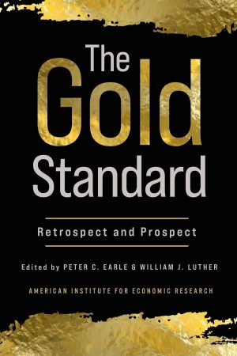

On August 15, 1971, President Richard Nixon closed the gold window. On the occasion of the fiftieth anniversary of this event, AIER published an edited [book on the gold standard](https://www.aier.org/product/gold-standard/). The functioning of this monetary regime is one of those topics that are surrounded more by myths than reality. AIER's book brings a reality check to the historical performance of the gold standard. As the editors of the book [Peter C. Earle](https://www.aier.org/staffs/peter-c-earle/) and [William J. Luther](https://williamjluther.com/) say (emphasis added): 

> In general, the gold standard effectively managed the money supply to stabilize the purchasing power of money over time. **This was no accident**.

You can see in the table of contents below that the book is novel in including a discussion about cryptocurrencies. I'm very lucky to be included in a volume along with some of my favorite monetary economists. I hope you consider reading the book and consume some real-world analysis of the merits and shortcomings of the gold standard.

---

## Table of contents

**Prologue**  
AIER Research Staff, August 1971  
**Chapter 1. Introduction**  
Peter C. Earle and William J. Luther  
**Chapter 2. The Rise and Fall of the Gold Standard in the United States**  
George Selgin  
**Chapter 3. How Does a Well-Functioning Gold Standard Function?**  
Peter C. Earle and William J. Luther  
**Chapter 4. Price Specie Flow Mechanism and the Monetary Approach to the Balance of Payments**  
Kwabena Boateng and Joshua Hendrickson  
**Chapter 5. How Good was the Gold Standard?**  
Thomas L. Hogan  
**Chapter 6. Arguments against the Gold Standard**  
Lawrence H. White  
**Chapter 7. Is the Gold Standard Feasible?**  
Bryan P. Cutsinger  
**Chapter 8. Monetary Rules: Is a Constrained Central Bank as Good as Gold?**  
Alexander W. Salter  
**Chapter 9. International Monies: The Gold Standard, Currency Boards, and Dollarization**  
Nicolas Cachanosky  
**Chapter 10. Digital Gold: The Case for Cryptocurrencies**  
William J. Luther  
**Chapter 11. Conclusion**  
Peter C. Earle and William J. Luther  



---

{}
