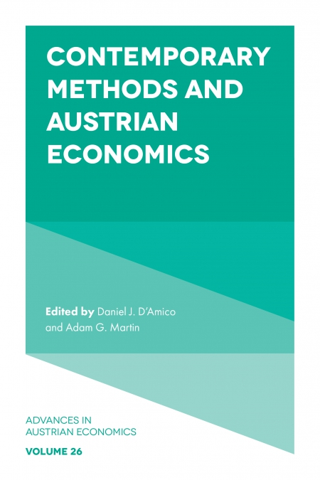

A new edited book by [Daniel J. D'Amico](https://ptp.brown.edu/people/daniel-j-damico) and [Adam G. Martin](https://www.depts.ttu.edu/freemarketinstitute/people/martin.php) on Austrian economics is out. This interdisciplinary edition discusses the role of new social scientific methods and the empirical approach to the Austrian school. My contribution, on the elusive empirics of capital theory, is included in chapter 8.

> Austrian economics is known for extensive—and many economists would say excessive—ruminations on methodology. Attempting to steer a middle course between radical forms of historicism (there are no economic laws) and scientism (economic laws are as precise as physical laws), this approach often appears to diminish the importance of empirical testing and quantitative methods more generally. Since the Austrian revival of the 1970’s, social scientists have developed a number of new theoretical and empirical approaches to studying the social world. Experimental and behavioral economics have exploded in popularity. Econometrics has arguably taken a more central role in the discipline than even formal economic theory. And, most prominently, econometricians have developed quasi-experimental techniques for examining real-world data as part of the “credibility revolution.”

> This volume, Contemporary Methods and Austrian Economics, examines the relationship between Austrian economics and these new social scientific methods. Do Austrian critiques of the excessive ambitions of formal theory and empirical measurement still hold water (if they ever did)? Do the findings of these new approaches bolster or undermine distinctively Austrian theories? How should we update our views on the relationship between abstract economic theory and empirical investigations?

---

## Table of contents

**Chapter 1. Austrian Economics and the New Paternalism**  
Daniel M. Hausman  
**Chapter 2. Austrian Critiques of Behavioral Economics: Common Misconceptions and Low Hanging Fruit**  
Jason A. Aimone  
**Chapter 3. Rules, Perception and the Intelligibility of Laboratory Experiments on Social Interaction in Economics**  
Erik O. Kimbrough  
**Chapter 4. Laboratory Experiments and Austrian Economics**  
Shaun P. Hargreaves Heap  
**Chapter 5. The Binding Force of Economics**  
Colin Harris, Andrew Myers, Christienne Briol, and Sam Carlen  
**Chapter 6. Causal Inference and Austrian Economics**  
Kevin Grier  
**Chapter 7. Information and Markets: Toward a critical sociological appreciation of F.A. Hayek**  
Bruce G. Carruthers  
**Chapter 8. The Elusive Empirics of Austrian Capital Theory**  
Nicolás Cachanosky  
**Chapter 9. How Cognitive Institutions and Interpretative Rationality enable Markets with Infinite Variety**  
Erwin Dekker



---

{}
